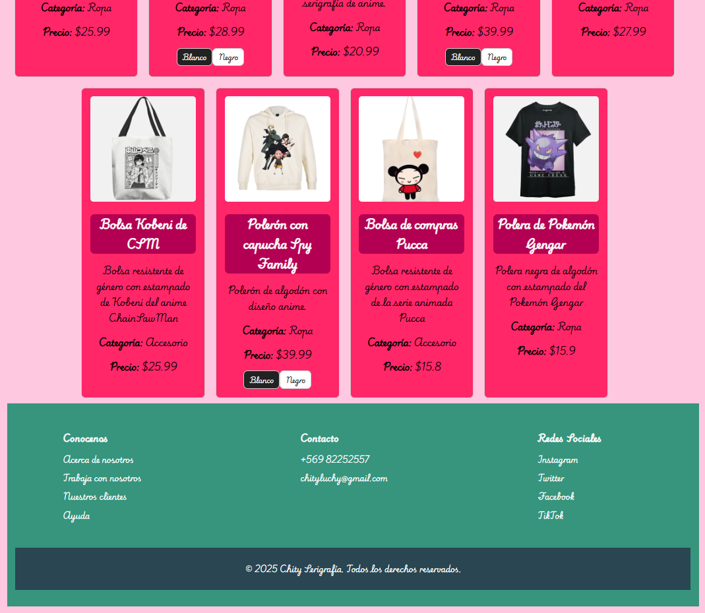
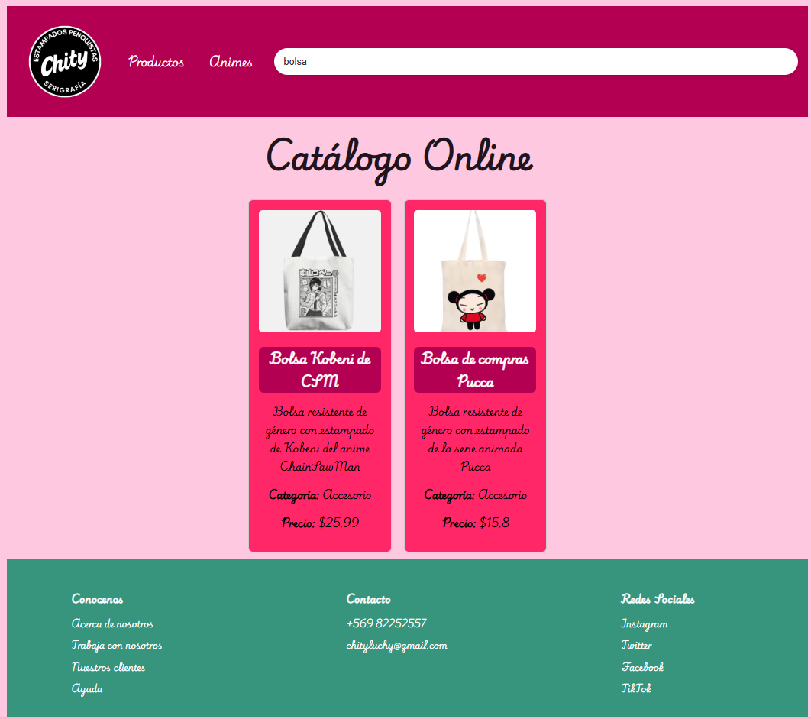
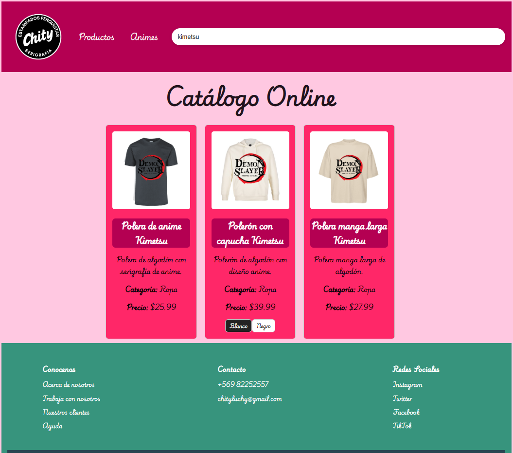

# Chity Serigrafía E-Commerce
## Luis Sepúlveda Villarroel

Esta es una página Web orientada a la venta de ropa personalizada con el arte de la serigrafía textil, la cual consiste en el uso de una técnica de estampado 
a partir de malla tensada, tinta y calor, la cual genera prendas con estampados más duraderos, colores más vivos, en distintos tipos de prendas o tejidos.

---

## COMPONENTES CREADOS

- HEADER:  Sección superior de la pagina web con el logo, nombre, etc.
- SEARCHBAR: Barra de búsqueda ubicada en el Header, la cual filtra el catálogo según lo que se escriba.
- PRODUCTCARD: Componente con la información escencial de un producto, imagen, nombre, descripcion, precio, etc.
- PRODUCTLIST: Componente que administra de manera individual los productos.
- VARIANTBUTTON: Componente botón que se muetra sólo si un producto tiene más de un color
- FOOTER: Sección inferior de la pagina web, con diversos datos y detalles del E-commerce

---

## INSTRUCCIONES DE INSTALCIÓN

i.- Primero que todo verificar si se tiene instalado Git en tu computadora. 
Por lo cual iremos a nuestra barra de búsqueda y abriremos el CMD o simbolo de sistema en modo administrador.
y pegaremos lo siguiente: git --version

    ia.- Si no nos aparece una versión en la consola, tendremos que dirigirnos a la siguiente url https://git-scm.com/install/windows
    caso contrario seguir con el paso ii. 

ii.- Ahora con Git instalado abriremos la aplicación Visual studio y vamos a presionar Ctrl + Shift + P

iii.- Vamos a escribir en el buscador git: clone 

iv.- Lo siguiente será pegar la url del repositorio que queremos clonar
en este caso será https://github.com/LuisSipps/Modulo2-Tarea1.git

v.- Siguiente paso sera elegir la carpeta de destino y aceptar.

vi.- Ahora volveremos a abrir nuestro CMD o símbolo de sistema en modo administrador, y mediante comandos deberemos llegar a la carpeta que contenga nuestro proyecto clonado. (Recomenadación: Escribir dir en el CMD para comprobar que exista el archivo package.json y así verificar que estamos en la ruta correcta).

vii Una vez dentro de nuestro proyecto tendremos que instalar las dependencias (npm) mediante el comando:
npm install

viii.- Una vez instaladas las dependecias desplegaremos nuestro proyecto con el comando:
npm run dev

ix.- Ahora nos aparecerá algo similar a esto http://localhost:5173/ 
Lo copiaremos y pegaremos en nuestro navegador y se deberia ver nuestra página web.

x.- SÓLO SI QUIERES CREAR UNA NUEVA RAMA
    xa.- Abre una terminal nueva en Visual Studio, en Terminal --> New Terminal
    xb.- Escribimos en la terminal git checkout -b NombreNuevaRama
    xc.- Ahora para crear la rama en Git/GitHub escribimos git push -u origin NombreNuevaRama

---

## TECNOLOGÍAS USADAS

- React.js -> Libreria Robusta de JavaScript para la construccion de aplicaciones web
- JavaScript -> Lenguaje de programación que permite crear contenido dinámico (lógica y manejo de estados)
- Vite --> Herramienta de compilación que permite una experiencia de desarrollo más rápida
- CSS3 --> Lenguaje de estilos y diseño
- Html5 --> Lenguaje de etiquetas que permiten darle estructura a un proyecto web
- Node.js --> Entorno de ejecición de Js que permite crear servidores, aplicaciones web, lineas de comando 
- Git & GitHub --> Software de control de versiones
---

## CAPTURAS DE LA PÁGINA WEB Y DEL BUSCADOR FUNCIONANDO

